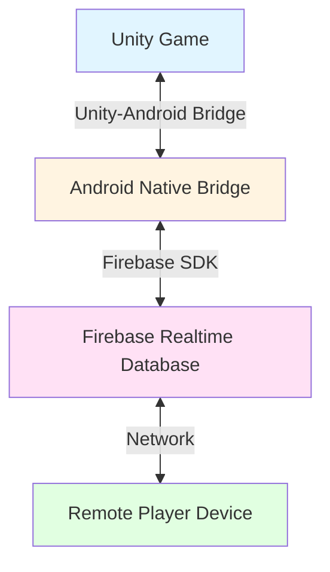
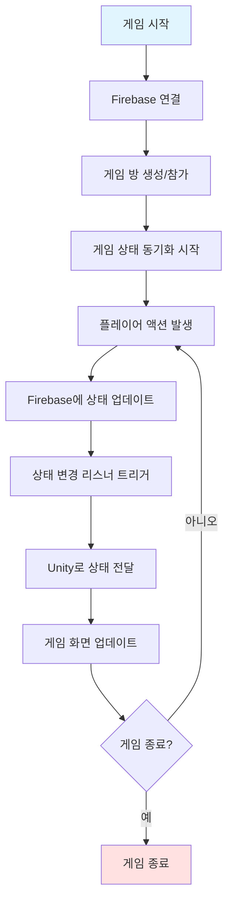
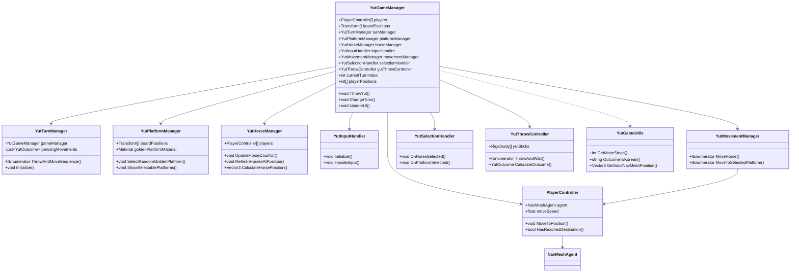
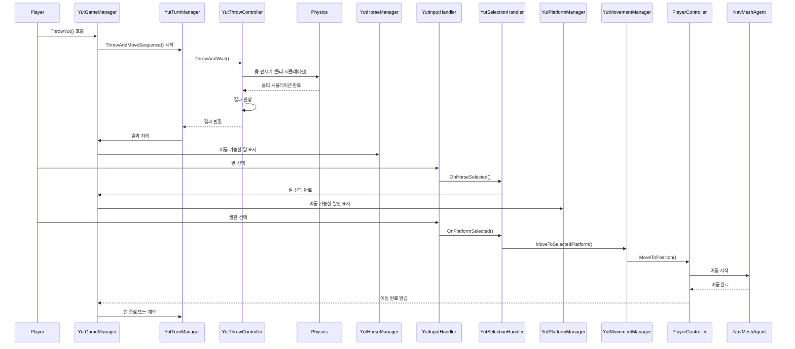
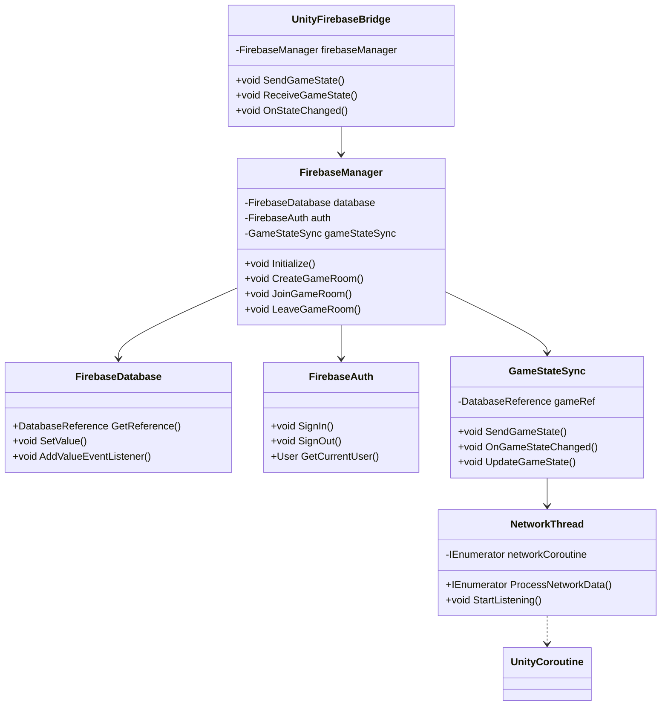
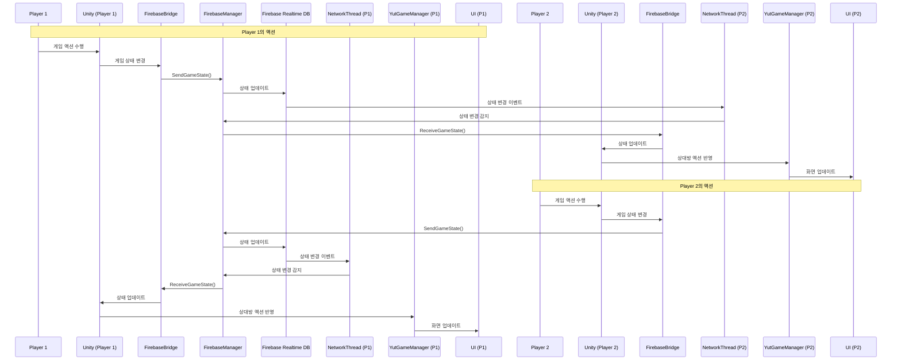

# 윷놀이 게임 프로젝트 다이어그램 모음

이 파일은 졸업작품 보고서에 포함된 모든 Mermaid 다이어그램을 모아놓은 파일입니다.

---

## 1. Android Studio - Circuit Diagram

Android Studio에서 구현된 Unity 연동 시스템의 구조입니다.

---

## 2. Android Studio - Flow Chart

게임 플레이 흐름도입니다.

---

## 3. Unity - Class Diagram

Unity 프로젝트의 주요 클래스 구조입니다.

---

## 4. Unity - Sequence Diagram

게임 플레이 중 윷 던지기 및 말 이동 시퀀스입니다.

---

## 5. Firebase - Class Diagram

Firebase 연동을 위한 클래스 구조입니다.

---

## 6. Firebase - Sequence Diagram

Firebase를 통한 실시간 멀티플레이어 시퀀스입니다.

---

## 사용 방법

이 파일의 Mermaid 다이어그램은 다음 환경에서 렌더링됩니다:

- GitHub / GitLab (마크다운 뷰어)
- VS Code (Mermaid 확장 설치 시)
- Mermaid Live Editor (https://mermaid.live/)
- Notion, Obsidian 등 Mermaid를 지원하는 에디터

각 다이어그램은 독립적으로 사용할 수 있으며, 보고서에 포함하거나 별도 문서로 활용할 수 있습니다.

