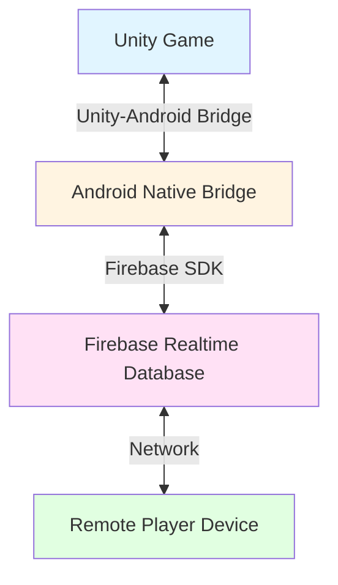
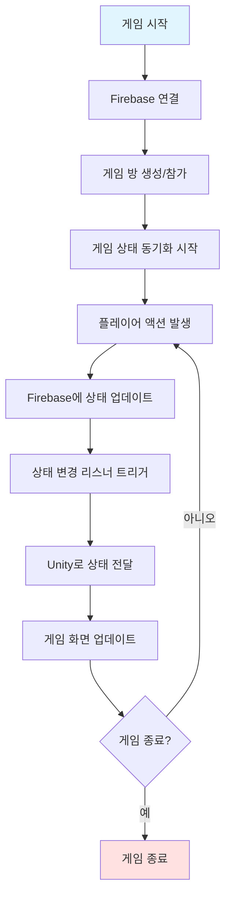
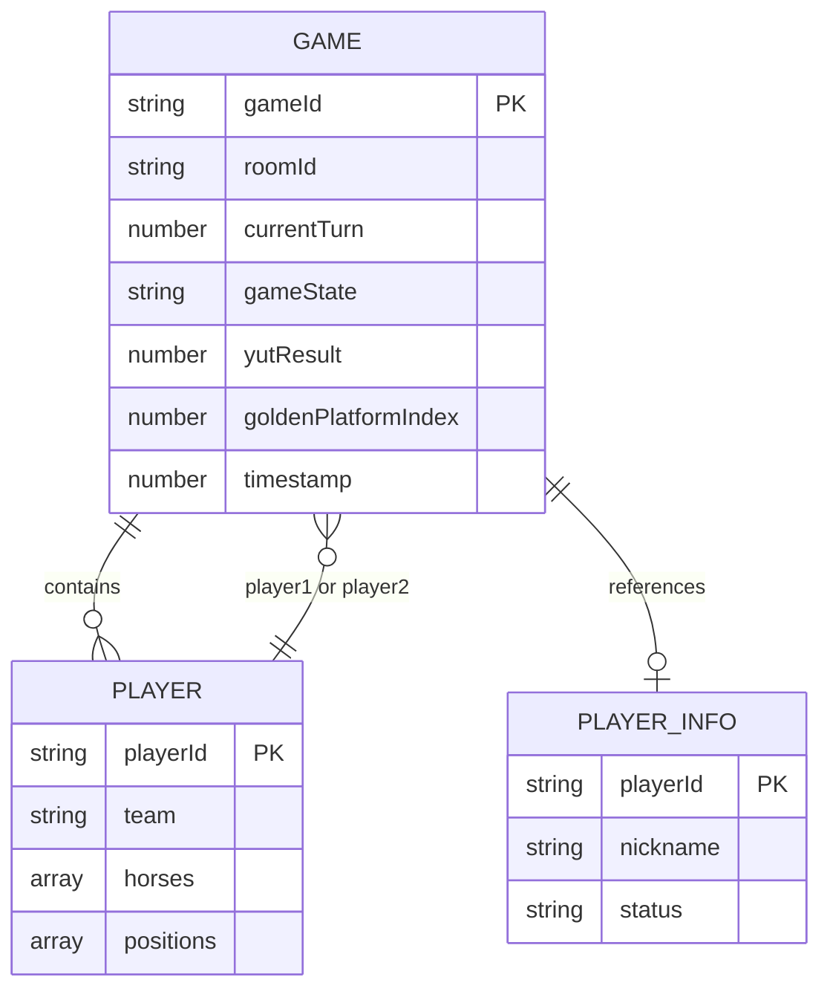
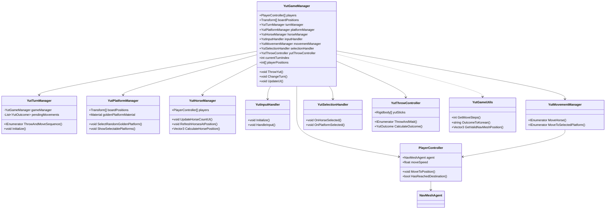
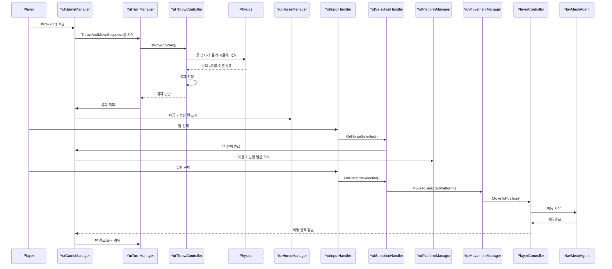
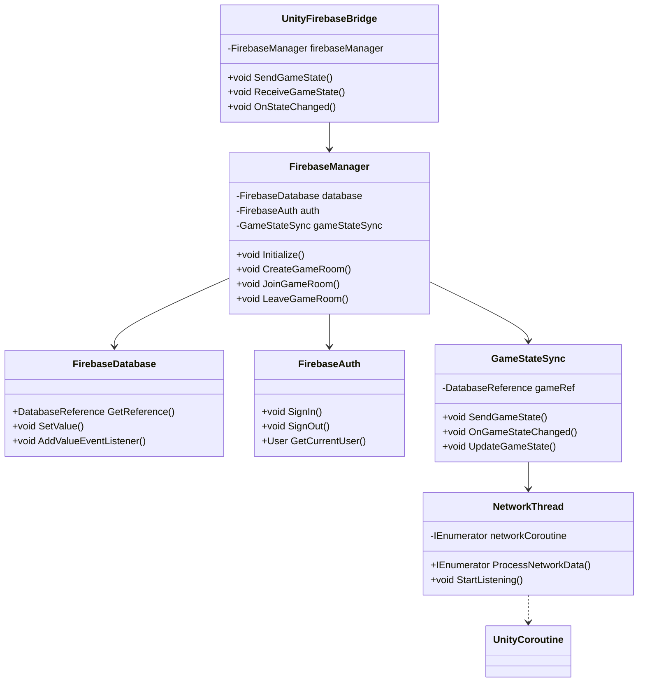
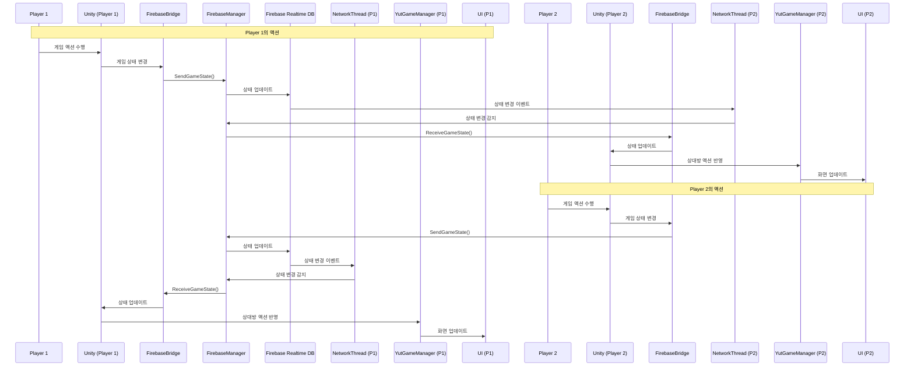

# 실시간 2인용 3D 윷놀이 게임 개발

1. 작품개요

1.1 작품개요

본 작품은 Unity 3D 엔진과 Android Studio를 활용하여 개발한 실시간 2인용 윷놀이 게임입니다. 전통 보드게임인 윷놀이를 3D 환경에서 구현하고, Firebase를 통한 실시간 멀티플레이어 기능을 제공합니다. 플레이어는 바바리안과 기사 두 팀으로 나뉘어 각각 4개의 말을 조작하며, 윷을 던져 나온 결과에 따라 말을 이동시켜 먼저 모든 말을 완주시키는 팀이 승리합니다.

GitHub 저장소: https://github.com/pepeddalki/Yutjabja.git

게임의 주요 특징은 다음과 같습니다:
- 물리 기반 윷 던지기 시스템
- NavMesh를 활용한 자연스러운 말 이동 애니메이션
- 황금 발판 시스템으로 게임의 재미 요소 추가
- 실시간 멀티플레이어 지원 (Firebase 연동 예정)

1.2 작품 선정 배경

전통 보드게임인 윷놀이는 한국의 대표적인 민속놀이 중 하나로, 디지털 시대에 접어들면서 점차 사라져가는 전통 문화를 현대적인 방식으로 재현하고자 하였습니다. 특히 모바일 게임 시장이 급성장하고 있는 현재, 스마트폰을 통해 언제 어디서나 친구나 가족과 함께 즐길 수 있는 윷놀이 게임의 필요성을 느꼈습니다.

또한 Unity 3D 엔진을 활용하여 3D 그래픽으로 구현함으로써 기존 2D 윷놀이 게임과 차별화하고, 물리 엔진을 활용한 윷 던지기 시스템을 통해 더욱 현실감 있는 게임 경험을 제공하고자 하였습니다.

1.3 유사 시스템 분석

현재 시장에 존재하는 윷놀이 게임들은 대부분 2D 기반이며, 단순한 턴제 게임 방식으로 구현되어 있습니다. 대표적인 예로는 "윷놀이" (모바일 앱), "전통 윷놀이" 등이 있습니다. 이러한 게임들의 한계점은 다음과 같습니다:

1. 2D 그래픽의 한계: 평면적인 게임 화면으로 인한 몰입감 부족
2. 단순한 게임플레이: 윷 던지기가 랜덤 결과로만 처리되어 현실감 부족
3. 멀티플레이어 지원 부족: 대부분 로컬 멀티플레이어만 지원
4. UI/UX의 단순함: 전통적인 디자인 요소 부족

본 작품은 이러한 한계점을 극복하기 위해 3D 그래픽, 물리 기반 윷 던지기, 실시간 멀티플레이어 기능을 구현하였습니다.

1.4 구현 범위 및 목표

구현 범위

1. Unity 3D 게임 엔진
   - 3D 윷놀이 보드 구현
   - 물리 기반 윷 던지기 시스템
   - NavMesh를 활용한 말 이동 시스템
   - 턴 관리 및 게임 로직 구현
   - UI/UX 구현

2. Android Studio
   - Unity와의 연동을 위한 네이티브 플러그인 개발
   - Unity-Android 통신 구조 설계
   - 비동기 네트워크 처리 설계

3. Firebase (구현 예정)
   - Firebase Realtime Database를 통한 실시간 데이터 동기화
   - 게임 상태 공유 및 동기화
   - 멀티플레이어 매칭 시스템

구현 목표

- 3D 환경에서의 자연스러운 게임플레이 구현
- 물리 기반 윷 던지기로 현실감 있는 게임 경험 제공
- 실시간 2인 멀티플레이어 지원
- 직관적이고 사용하기 쉬운 UI/UX 제공
- 안정적인 게임 로직 및 상태 관리

1.5 개발 환경

하드웨어 환경
- 개발 PC: Windows 10
- 테스트 기기: Android 스마트폰

소프트웨어 환경
- Unity: 2022.3 LTS
- Android Studio: 최신 버전
- 프로그래밍 언어: C# (Unity), Java/Kotlin (Android)
- 버전 관리: Git
  - GitHub 저장소: https://github.com/pepeddalki/Yutjabja.git
- 데이터베이스: Firebase Realtime Database (예정)

주요 라이브러리 및 패키지
- Unity Input System
- TextMeshPro
- Unity NavMesh System
- Firebase SDK (예정)

---

2. 관련 기술

2.1 Unity NavMesh System

Unity NavMesh System은 Unity의 AI Navigation 패키지를 통해 제공되는 경로 찾기 및 이동 시스템입니다. 본 작품에서는 말의 자연스러운 이동을 구현하기 위해 NavMeshAgent 컴포넌트를 활용하였습니다.

NavMesh 활용 목적
- 말의 발판 간 이동 경로 자동 계산
- 장애물 회피 및 최적 경로 탐색
- 자연스러운 이동 애니메이션 구현

구현 방식
```csharp
// PlayerController.cs에서 NavMeshAgent 사용
public class PlayerController : MonoBehaviour
{
    private NavMeshAgent agent;
    
    public void InitializeAgent()
    {
        agent = GetComponent<NavMeshAgent>();
        agent.speed = moveSpeed;
        agent.angularSpeed = rotationSpeed;
        agent.stoppingDistance = 0.3f;
    }
    
    public void MoveToPosition(Vector3 targetPosition)
    {
        NavMeshHit hit;
        if (NavMesh.SamplePosition(targetPosition, out hit, 5f, NavMesh.AllAreas))
        {
            agent.SetDestination(hit.position);
        }
    }
}
```

2.2 Unity Physics System

Unity Physics System은 Rigidbody와 Collider를 활용한 물리 시뮬레이션 시스템입니다. 본 작품에서는 윷 던지기의 현실감 있는 물리적 상호작용을 구현하기 위해 활용하였습니다.

Physics System 활용 목적
- 윷의 물리적 던지기 시뮬레이션
- 윷과 보드 간의 충돌 감지
- 윷의 회전 및 중력 효과 구현
- 윷 결과 판정을 위한 상태 감지

구현 방식
```csharp
// YutThrowController.cs에서 Rigidbody 사용
public class YutThrowController : MonoBehaviour
{
    public Rigidbody[] yutSticks; // 길이 4
    
    public IEnumerator ThrowAndWait()
    {
        foreach (var stick in yutSticks)
        {
            Vector3 force = Vector3.up * upwardForce;
            stick.AddForce(force);
            stick.AddTorque(Random.insideUnitSphere * torqueForce);
            yield return new WaitForSeconds(fireInterval);
        }
        
        // 윷이 멈출 때까지 대기
        yield return StartCoroutine(WaitForSettle());
        
        // 결과 판정
        LastOutcome = CalculateOutcome();
    }
}
```

2.3 Unity Input System

Unity Input System은 Unity의 새로운 입력 처리 시스템으로, 다양한 입력 장치를 지원하고 이벤트 기반 입력 처리를 제공합니다. 본 작품에서는 플레이어의 말 선택 및 발판 선택 입력을 처리하기 위해 활용하였습니다.

Input System 활용 목적
- 마우스 클릭 및 터치 입력 처리
- 발판 및 말 선택 감지
- 게임 오브젝트 레이캐스팅

구현 방식
```csharp
// YutInputHandler.cs에서 Input System 사용
public class YutInputHandler : MonoBehaviour
{
    private Camera mainCamera;
    private InputAction clickAction;
    
    void Update()
    {
        if (Input.GetMouseButtonDown(0))
        {
            Ray ray = mainCamera.ScreenPointToRay(Input.mousePosition);
            RaycastHit hit;
            
            if (Physics.Raycast(ray, out hit))
            {
                // 발판 또는 말 선택 처리
                OnObjectClicked(hit.collider.gameObject);
            }
        }
    }
}
```

2.4 Unity Coroutine

Unity Coroutine은 비동기 작업을 처리하기 위한 Unity의 코루틴 시스템입니다. 본 작품에서는 윷 던지기, 말 이동, 턴 관리 등 시간이 걸리는 작업들을 순차적으로 처리하기 위해 활용하였습니다.

Coroutine 활용 목적
- 윷 던지기 애니메이션 및 대기 처리
- 말 이동 시퀀스 순차 실행
- 턴 전환 및 게임 상태 변경 처리
- 비동기 작업의 순차적 제어

구현 방식
```csharp
// YutTurnManager.cs에서 Coroutine 사용
public class YutTurnManager : MonoBehaviour
{
    public IEnumerator ThrowAndMoveSequence()
    {
        // 윷 던지기
        yield return StartCoroutine(yutThrowController.ThrowAndWait());
        
        // 결과 처리
        YutOutcome outcome = yutThrowController.LastOutcome;
        
        // 말 이동
        yield return StartCoroutine(ProcessMovement(outcome));
        
        // 턴 종료
        gameManager.ChangeTurn();
    }
}
```

2.5 TextMeshPro

TextMeshPro는 Unity의 고급 텍스트 렌더링 시스템으로, 고품질의 텍스트 표시를 제공합니다. 본 작품에서는 게임 상태 표시, 윷 결과 표시, 말 개수 표시 등 UI 텍스트를 구현하기 위해 활용하였습니다.

TextMeshPro 활용 목적
- 게임 상태 및 턴 정보 표시
- 윷 결과 텍스트 표시
- 말 개수 UI (x2, x3 등) 표시
- Billboard 효과를 통한 항상 카메라를 향하는 텍스트

구현 방식
```csharp
// YutHorseManager.cs에서 TextMeshPro 사용
public void UpdateHorseCountUI(int horseIndex, int count)
{
    GameObject uiObj = new GameObject($"HorseCountUI_{horseIndex}");
    TextMeshPro textMesh = uiObj.AddComponent<TextMeshPro>();
    textMesh.text = $"x{count}";
    textMesh.fontSize = 16f;
    textMesh.color = Color.white;
    textMesh.alignment = TextAlignmentOptions.Center;
    
    // Billboard 컴포넌트 추가
    uiObj.AddComponent<Billboard>().targetCamera = Camera.main;
}
```

---

3. 구현내용

3.1 Android Studio

3.1.1 Circuit Diagram

Android Studio에서 구현된 Unity 연동 시스템의 구조는 다음과 같습니다:



주요 컴포넌트
1. UnityPlayer: Unity 게임 엔진과의 통신 담당
2. FirebaseManager: Firebase 데이터베이스 관리
3. NetworkThread: 비동기 네트워크 처리
4. GameStateSync: 게임 상태 동기화 관리

3.1.2 Flow Chart



3.1.3 Database Schema (Structures)

Firebase Realtime Database의 데이터 구조는 다음과 같이 설계되었습니다:



데이터 구조 상세 설명:

게임 데이터 (games/gameId/):
- roomId: string - 게임 방 ID
- player1: Player 객체 - 플레이어 1 정보
  - playerId: string - 플레이어 1 ID
  - team: "barbarian" - 바바리안 팀
  - horses: [0, 1, 2, 3] - 말 인덱스 배열
  - positions: [-1, -1, -1, -1] - 말 위치 배열 (-1은 대기공간)
- player2: Player 객체 - 플레이어 2 정보
  - playerId: string - 플레이어 2 ID
  - team: "knight" - 기사 팀
  - horses: [4, 5, 6, 7] - 말 인덱스 배열
  - positions: [-1, -1, -1, -1] - 말 위치 배열
- currentTurn: number - 현재 턴 (0 또는 1)
- gameState: string - 게임 상태 ("waiting" | "playing" | "finished")
- yutResult: number | null - 윷 결과 (null은 아직 던지지 않음)
- goldenPlatformIndex: number - 황금 발판 인덱스
- timestamp: number - 타임스탬프

플레이어 정보 (players/playerId/):
- nickname: string - 플레이어 닉네임
- status: string - 플레이어 상태 ("online" | "offline" | "ingame")

3.2 Unity

3.2.1 Application UI

Unity에서 구현된 게임 UI는 다음과 같이 구성됩니다:

1. 메인 메뉴 화면
   - 게임 시작 버튼
   - 멀티플레이어 모드 선택
   - 설정 메뉴

2. 게임 플레이 화면
   - 윷 던지기 버튼
   - 현재 턴 표시 (다음 차례: 바바리안/기사)
   - 완주한 말 수 표시 (들어온 말)
   - 윷 결과 표시

3. 게임 종료 화면
   - 승리 팀 표시
   - 재시작 버튼
   - 메인 메뉴로 돌아가기

주요 UI 컴포넌트
- TextMeshProUGUI: 게임 상태 및 결과 표시
- Button: 윷 던지기 및 테스트 버튼
- Canvas: UI 레이어 관리

3.2.2 Class Diagram

Unity 프로젝트의 주요 클래스 구조는 다음과 같습니다:



주요 클래스 설명

YutGameManager
- 게임의 전체 상태를 관리하는 메인 클래스
- 플레이어 위치, 턴 관리, 게임 로직 처리
- 다른 매니저 클래스들을 조율

YutTurnManager
- 턴 순서 관리
- 윷 던지기 및 이동 시퀀스 처리
- 대기 중인 이동 목록 관리

YutPlatformManager
- 발판의 시각적 상태 관리
- 황금 발판 선택 및 표시
- 선택 가능한 발판 하이라이트

YutHorseManager
- 말의 위치 및 상태 관리
- 업힌 말 처리 (x2, x3 등 UI 표시)
- 말 선택 및 하이라이트

YutThrowController
- 물리 기반 윷 던지기 처리
- 윷 결과 판정 (도, 개, 걸, 윷, 모, 빽도, 낙)
- 윷 초기 위치로 리셋

PlayerController
- NavMeshAgent를 활용한 말 이동
- 애니메이션 제어
- 목적지 도착 판정

3.2.3 Sequence Diagram

게임 플레이 중 윷 던지기 및 말 이동 시퀀스는 다음과 같습니다:



3.3 Firebase

3.3.1 Application UI

Firebase 연동을 위한 UI는 게임 내에서 다음과 같이 구현될 예정입니다:

1. 멀티플레이어 메뉴
   - 게임 방 생성 버튼
   - 게임 방 참가 버튼
   - 게임 방 목록 표시
   - 연결 상태 표시 (온라인/오프라인)

2. 게임 중 동기화 표시
   - 상대방 턴 대기 표시
   - 네트워크 지연 표시 (선택사항)
   - 연결 끊김 알림

3.3.2 Class Diagram

Firebase 연동을 위한 클래스 구조는 다음과 같이 설계되었습니다:



주요 클래스 설명 

FirebaseManager
- Firebase Realtime Database 연결 및 관리
- 게임 방 생성/참가/나가기 처리
- 실시간 데이터 리스너 등록 및 해제

GameStateSync
- 게임 상태를 Firebase에 동기화
- 상대방의 게임 상태 변경 감지
- 충돌 해결 및 상태 일관성 유지

UnityFirebaseBridge
- Unity와 Firebase 간의 데이터 교환
- 게임 상태를 Unity 형식으로 변환
- Unity 이벤트를 Firebase 이벤트로 변환

3.3.3 Sequence Diagram

Firebase를 통한 실시간 멀티플레이어 시퀀스는 다음과 같이 구현될 예정입니다:



Firebase 구현 계획

1. Firebase 프로젝트 설정
   - Firebase Console에서 프로젝트 생성
   - Android 앱 등록 및 google-services.json 추가
   - Unity Firebase SDK 통합

2. 데이터베이스 구조 설계
   - 게임 방 구조 정의
   - 플레이어 정보 구조 정의
   - 게임 상태 구조 정의

3. 실시간 동기화 구현
   - 게임 상태 변경 시 Firebase 업데이트
   - ValueEventListener를 통한 실시간 상태 감지
   - 충돌 해결 로직 구현

4. 에러 처리 및 재연결 로직
   - 네트워크 오류 처리
   - 자동 재연결 기능
   - 게임 상태 복구 로직

---

4. 결론

4.1 결론

본 작품에서는 Unity 3D 엔진과 Android Studio를 활용하여 실시간 2인용 3D 윷놀이 게임을 개발하였습니다. 주요 성과는 다음과 같습니다:

1. 3D 게임 환경 구현: Unity를 활용하여 3D 윷놀이 보드와 캐릭터를 구현하고, NavMesh를 통한 자연스러운 말 이동 시스템을 구축하였습니다.

2. 물리 기반 윷 던지기: Unity의 물리 엔진을 활용하여 현실감 있는 윷 던지기 시스템을 구현하였습니다. Rigidbody와 Collider를 활용하여 윷의 물리적 상호작용을 시뮬레이션하고, 결과를 정확하게 판정합니다.

3. 모듈화된 게임 구조: 게임 로직을 여러 매니저 클래스로 분리하여 유지보수성과 확장성을 높였습니다. YutGameManager, YutTurnManager, YutPlatformManager, YutHorseManager 등으로 역할을 분리하여 코드의 가독성을 향상시켰습니다.

4. 완전한 게임 로직 구현: 윷놀이의 모든 규칙을 구현하였습니다. 도, 개, 걸, 윷, 모, 빽도, 낙의 모든 경우를 처리하고, 말 업기, 적 말 잡기, 황금 발판 시스템 등 게임의 모든 기능을 구현하였습니다.

5. Android 연동 준비: Unity-Android 연동 구조를 설계하고, Firebase를 통한 실시간 멀티플레이어 구현 계획을 수립하였습니다.

6. Firebase 연동 계획 수립: 실시간 멀티플레이어를 위한 Firebase Realtime Database 구조와 동기화 로직을 설계하였습니다.

4.2 추후 과제

1. Firebase 실시간 멀티플레이어 구현
   - Firebase Realtime Database 연동 완료
   - 게임 상태 실시간 동기화 구현
   - 네트워크 오류 처리 및 재연결 로직 구현
   - 게임 방 매칭 시스템 구현

2. 게임 최적화
   - 프레임 드롭 최소화
   - 메모리 사용량 최적화
   - 네트워크 데이터 전송량 최적화

3. 추가 기능 구현
   - 사운드 효과 및 배경음악 추가
   - 파티클 효과 추가 (윷 던지기, 말 이동 등)
   - 캐릭터 애니메이션 개선
   - 게임 리플레이 기능

4. UI/UX 개선
   - 더 직관적인 사용자 인터페이스
   - 튜토리얼 시스템
   - 설정 메뉴 (사운드, 그래픽 등)

5. 테스트 및 디버깅
   - 멀티플레이어 환경에서의 충돌 테스트
   - 다양한 기기에서의 호환성 테스트
   - 성능 프로파일링 및 최적화

6. 배포 준비
   - Google Play Store 출시 준비
   - 앱 아이콘 및 스크린샷 제작
   - 개인정보 처리방침 및 이용약관 작성

---

5. 참고문헌

1. Unity Technologies. (2023). *Unity User Manual*. Unity Documentation. https://docs.unity3d.com/

2. Google. (2023). *Firebase Realtime Database Documentation*. Firebase Documentation. https://firebase.google.com/docs/database

3. Unity Technologies. (2023). *Unity NavMesh System Documentation*. Unity Documentation. https://docs.unity3d.com/Manual/nav-BuildingNavMesh.html

4. Unity Technologies. (2023). *Unity Physics System Documentation*. Unity Documentation. https://docs.unity3d.com/Manual/PhysicsSection.html

5. Unity Technologies. (2023). *Unity Input System Documentation*. Unity Documentation. https://docs.unity3d.com/Packages/com.unity.inputsystem@latest/

6. Unity Technologies. (2023). *TextMeshPro Documentation*. Unity Documentation. https://docs.unity3d.com/Manual/com.unity.textmeshpro.html

7. 한국민속대백과사전. (2023). "윷놀이". 한국학중앙연구원. https://folkency.nfm.go.kr/

8. 프로젝트 GitHub 저장소: https://github.com/pepeddalki/Yutjabja.git

---

부록

부록 I. 졸업작품 사진

*(실제 게임 스크린샷 및 개발 환경 사진을 여기에 첨부)*

1. 게임 메인 화면
2. 게임 플레이 화면
3. 윷 던지기 장면
4. 말 이동 애니메이션
5. 게임 종료 화면

부록 II. 핵심 Source Code

Unity - YutGameManager.cs (핵심 부분)

```csharp
public class YutGameManager : MonoBehaviour
{
    [Header("Game Components")]
    public PlayerController[] players; // 0~3: 바바리안, 4~7: 기사
    public Transform[] boardPositions; // 나무 발판 위치들 (A1~F5)
    public Button throwButton;
    public TextMeshProUGUI resultText;
    public TextMeshProUGUI positionText;
    public YutThrowController yutThrowController;
    
    [Header("Managers")]
    public YutPlatformManager platformManager;
    public YutHorseManager horseManager;
    public YutInputHandler inputHandler;
    public YutMovementManager movementManager;
    public YutTurnManager turnManager;
    public YutSelectionHandler selectionHandler;
    
    [Header("Game State")]
    public int currentTurnIndex = 0; // 0: 바바리안, 1: 기사
    public int[] playerPositions; // 0~3: 바바리안, 4~7: 기사
    public bool isPlayerMoving = false;
    public bool canThrowAgain = false;
    private Vector3[] horseInitialPositions; // 각 말의 초기 시작 위치
    
    void Start()
    {
        // 매니저 자동 초기화
        if (platformManager == null)
        {
            platformManager = GetComponent<YutPlatformManager>();
            if (platformManager == null)
            {
                platformManager = gameObject.AddComponent<YutPlatformManager>();
            }
            platformManager.boardPositions = boardPositions;
            platformManager.goldenPlatformMaterial = goldenPlatformMaterial;
        }
        
        // playerPositions 배열 초기화
        if (playerPositions == null || playerPositions.Length != 8)
        {
            playerPositions = new int[8] {-1, -1, -1, -1, -1, -1, -1, -1};
        }
        
        // 각 말의 초기 위치 좌표 설정
        horseInitialPositions = new Vector3[8];
        horseInitialPositions[0] = new Vector3(97.5f, 1.5f, 32f);  // 바바리안1
        horseInitialPositions[1] = new Vector3(105f, 1.5f, 32f);   // 바바리안2
        horseInitialPositions[2] = new Vector3(97.5f, 1.5f, 28f);  // 바바리안3
        horseInitialPositions[3] = new Vector3(105f, 1.5f, 28f);   // 바바리안4
        horseInitialPositions[4] = new Vector3(90f, 1.5f, 32f);     // 기사1
        horseInitialPositions[5] = new Vector3(82.5f, 1.5f, 32f);  // 기사2
        horseInitialPositions[6] = new Vector3(90f, 1.5f, 28f);    // 기사3
        horseInitialPositions[7] = new Vector3(82.5f, 1.5f, 28f);  // 기사4
        
        // 각 말의 transform.position을 초기 위치로 설정
        for (int i = 0; i < players.Length; i++)
        {
            if (players[i] != null)
            {
                players[i].transform.position = horseInitialPositions[i];
            }
        }
        
        // 발판 렌더러 초기화
        platformManager.InitializePlatformRenderers();
        platformManager.SelectRandomGoldenPlatform();
        
        UpdateUI();
    }
    
    public void ThrowYut()
    {
        if (isPlayerMoving) return;
        
        if (turnManager != null)
        {
            StartCoroutine(turnManager.ThrowAndMoveSequence());
        }
    }
    
    public void ChangeTurn()
    {
        currentTurnIndex = (currentTurnIndex + 1) % 2;
    }
    
    public void UpdateUI()
    {
        if (positionText != null)
        {
            string positionInfo = "들어온 말\n\n";
            positionInfo += $"기사 : {knightFinishedCount}\n";
            positionInfo += $"바바리안 : {barbarianFinishedCount}\n";
            positionText.text = positionInfo;
        }
        
        if (resultText != null)
        {
            int nextPlayerIndex = GetCurrentPlayerIndex();
            string nextPlayerName = playerNames[nextPlayerIndex];
            string turnInfo = $"다음 차례: {nextPlayerName} 팀";
            if (canThrowAgain)
            {
                turnInfo += " (한 번 더 던지세요!)";
            }
            resultText.text = turnInfo;
        }
    }
    
    public List<int> CalculateAvailablePositions(int currentPosition, int moveSteps)
    {
        List<int> availablePositions = new List<int>();
        
        // 대기공간(-1)에서 시작하는 경우, A1(0)에서 시작하는 것으로 계산
        int calcPosition = currentPosition == -1 ? 0 : currentPosition;
        
        // B1(5) 또는 C1(10)에서 시작하는 경우 분기 경로 계산
        if (calcPosition == 5 && moveSteps > 0) // B1에서 시작
        {
            // E1(20)로 분기하는 경로
            int e1Position = 20;
            if (moveSteps == 1)
            {
                availablePositions.Add(e1Position);
            }
            else
            {
                // E1에서 moveSteps-1만큼 더 이동
                int nextPos = GetNextPositionInPath(e1Position);
                for (int i = 1; i < moveSteps; i++)
                {
                    nextPos = GetNextPositionInPath(nextPos);
                }
                availablePositions.Add(nextPos);
            }
        }
        else if (calcPosition == 10 && moveSteps > 0) // C1에서 시작
        {
            // F1(25)로 분기하는 경로
            int f1Position = 25;
            if (moveSteps == 1)
            {
                availablePositions.Add(f1Position);
            }
            else
            {
                // F1에서 moveSteps-1만큼 더 이동
                int nextPos = GetNextPositionInPath(f1Position);
                for (int i = 1; i < moveSteps; i++)
                {
                    nextPos = GetNextPositionInPath(nextPos);
                }
                availablePositions.Add(nextPos);
            }
        }
        else
        {
            // 일반 경로: 현재 위치에서 moveSteps만큼 이동
            int nextPos = calcPosition;
            for (int i = 0; i < moveSteps; i++)
            {
                nextPos = GetNextPositionInPath(nextPos);
            }
            availablePositions.Add(nextPos);
        }
        
        return availablePositions;
    }
    
    private int GetNextPositionInPath(int currentPos)
    {
        // 윷놀이 보드 경로 계산 (29개 발판)
        // A1(0) -> A2(1) -> ... -> A5(4) -> B1(5) -> ... -> F5(28) -> A1(0)
        if (currentPos >= 0 && currentPos < 28)
        {
            return currentPos + 1;
        }
        else if (currentPos == 28) // F5
        {
            return 0; // A1로 순환
        }
        return currentPos;
    }
    
    public IEnumerator MoveHorseInternal(int horseIndex, int steps)
    {
        isPlayerMoving = true;
        
        // 이동할 말 목록 (업힌 말들)
        List<int> horsesToMoveTogether = new List<int>();
        int startPosition = playerPositions[horseIndex];
        bool isBarbarian = horseIndex < 4;
        
        // 대기공간(-1)에서 시작하는 경우, A1(0)으로 시작
        if (playerPositions[horseIndex] == -1)
        {
            playerPositions[horseIndex] = 0;
            startPosition = 0;
        }
        
        for (int i = 0; i < steps; i++)
        {
            bool isLastStep = (i == steps - 1);
            int currentPos = playerPositions[horseIndex];
            int nextPos = GetNextPositionInPath(currentPos);
            
            // B1(5) 또는 C1(10)에서 분기 처리
            if (currentPos == 5 && i == 0) // B1에서 시작
            {
                nextPos = 20; // E1로 분기
            }
            else if (currentPos == 10 && i == 0) // C1에서 시작
            {
                nextPos = 25; // F1로 분기
            }
            
            playerPositions[horseIndex] = nextPos;
            
            // 함께 이동한 말들도 같은 발판으로 이동
            foreach (int otherHorseIndex in horsesToMoveTogether)
            {
                playerPositions[otherHorseIndex] = nextPos;
            }
            
            // A0(인덱스 0)에 도착하면 말이 완주 완료
            if (nextPos == 0 && isLastStep)
            {
                players[horseIndex].gameObject.SetActive(false);
                playerPositions[horseIndex] = -2; // 완주 완료
                
                // 완주한 말 수 증가
                if (horseIndex < 4)
                {
                    barbarianFinishedCount++;
                }
                else
                {
                    knightFinishedCount++;
                }
                
                UpdateUI();
                yield break;
            }
            
            // 최종 발판에서 적의 말 잡기 처리
            if (isLastStep)
            {
                int finalPos = playerPositions[horseIndex];
                List<int> enemyHorsesToCapture = new List<int>();
                
                for (int j = 0; j < playerPositions.Length; j++)
                {
                    if (j != horseIndex && playerPositions[j] == finalPos)
                    {
                        bool jIsBarbarian = j < 4;
                        if (jIsBarbarian != isBarbarian)
                        {
                            enemyHorsesToCapture.Add(j);
                        }
                    }
                }
                
                // 적의 말을 잡았으면 시작 위치로 보내기
                if (enemyHorsesToCapture.Count > 0)
                {
                    foreach (int enemyHorseIndex in enemyHorsesToCapture)
                    {
                        Vector3 initialPosVector = horseInitialPositions[enemyHorseIndex];
                        playerPositions[enemyHorseIndex] = -1;
                        
                        if (players[enemyHorseIndex] != null)
                        {
                            UnityEngine.AI.NavMeshAgent agent = 
                                players[enemyHorseIndex].GetComponent<UnityEngine.AI.NavMeshAgent>();
                            bool wasEnabled = agent != null && agent.enabled;
                            if (agent != null) agent.enabled = false;
                            
                            players[enemyHorseIndex].transform.position = initialPosVector;
                            players[enemyHorseIndex].gameObject.SetActive(true);
                            
                            if (agent != null && wasEnabled)
                            {
                                agent.enabled = true;
                                agent.Warp(initialPosVector);
                            }
                        }
                    }
                }
            }
            
            // 말 이동 애니메이션
            Vector3 targetPosition = boardPositions[playerPositions[horseIndex]].position;
            if (players[horseIndex] != null)
            {
                players[horseIndex].MoveToPosition(targetPosition);
                
                while (!players[horseIndex].HasReachedDestination())
                {
                    yield return null;
                }
            }
            
            yield return new WaitForSeconds(0.1f);
        }
        
        isPlayerMoving = false;
    }
    
    public int GetCurrentPlayerIndex()
    {
        return currentTurnIndex; // 0: 바바리안, 1: 기사
    }
    
    public List<int> GetAvailableHorsesForCurrentPlayer()
    {
        List<int> availableHorses = new List<int>();
        int startIndex = currentTurnIndex == 0 ? 0 : 4;
        int endIndex = currentTurnIndex == 0 ? 4 : 8;
        
        for (int i = startIndex; i < endIndex; i++)
        {
            if (playerPositions[i] != -2) // 완주하지 않은 말
            {
                availableHorses.Add(i);
            }
        }
        
        return availableHorses;
    }
}
```

Unity - YutTurnManager.cs (핵심 부분)

```csharp
public class YutTurnManager : MonoBehaviour
{
    private YutGameManager gameManager;
    private List<YutOutcome> pendingMovements;
    private bool hasSavedYutOutcome = false;
    private YutOutcome savedYutOutcome = YutOutcome.Nak;
    
    public void Initialize(YutGameManager manager)
    {
        this.gameManager = manager;
        pendingMovements = new List<YutOutcome>();
    }
    
    public IEnumerator ThrowAndMoveSequence(YutOutcome? testOutcome = null, bool testBackDo = false)
    {
        // 추가 던질 기회가 있었다면 이번 던지기에서 사용하므로 리셋
        if (gameManager.canThrowAgain)
        {
            gameManager.canThrowAgain = false;
        }
        
        YutOutcome outcome;
        
        // 테스트 모드인지 확인
        if (testOutcome.HasValue)
        {
            outcome = testOutcome.Value;
            if (testBackDo)
            {
                outcome = YutOutcome.Do;
            }
        }
        else
        {
            // 일반 모드: 물리 윷 던지기
            yield return StartCoroutine(gameManager.yutThrowController.ThrowAndWait());
            outcome = gameManager.yutThrowController.LastOutcome;
        }
        
        int yutResult = (int)outcome;
        int moveSteps = YutGameUtils.GetMoveSteps(yutResult);
        
        // 윷(4)/모(5): 이동 없이 한 번 더 던지기 (턴 유지), 결과 저장
        if (yutResult == 4 || yutResult == 5)
        {
            if (hasSavedYutOutcome)
            {
                // 저장된 윷/모와 새로 나온 결과를 대기 목록에 추가
                pendingMovements.Add(savedYutOutcome);
                pendingMovements.Add(outcome);
                hasSavedYutOutcome = false;
                
                // 대기 중인 이동이 모두 처리될 때까지 반복
                yield return StartCoroutine(ProcessPendingMovements());
            }
            else
            {
                // 새로운 윷/모가 나온 경우: 결과 저장하고 한 번 더 던지기
                savedYutOutcome = outcome;
                hasSavedYutOutcome = true;
                
                gameManager.canThrowAgain = true;
                gameManager.UpdateUI();
                yield break;
            }
        }
        else if (pendingMovements.Count == 0 && ((yutResult >= 1 && yutResult <= 3) || testBackDo))
        {
            // pendingMovements가 비어있고 도/개/걸/빽도가 나온 경우
            pendingMovements.Add(outcome);
            
            // 대기 중인 이동이 모두 처리될 때까지 반복
            yield return StartCoroutine(ProcessPendingMovements());
        }
        
        // 턴 변경
        gameManager.ChangeTurn();
        gameManager.UpdateUI();
    }
    
    private IEnumerator ProcessPendingMovements()
    {
        while (pendingMovements.Count > 0)
        {
            // 상태 변수 리셋
            gameManager.waitingForHorseSelection = false;
            gameManager.waitingForPlatformSelection = false;
            gameManager.currentHorseIndexForMove = -1;
            
            List<int> horsesToSelect = gameManager.GetAvailableHorsesForCurrentPlayer();
            if (horsesToSelect.Count > 0)
            {
                gameManager.ShowSelectableHorses(horsesToSelect);
                gameManager.waitingForHorseSelection = true;
                
                // 말 선택 대기
                while (gameManager.waitingForHorseSelection)
                {
                    yield return null;
                }
                
                // 발판 선택 대기
                while (gameManager.waitingForPlatformSelection)
                {
                    yield return null;
                }
                
                // 이동 완료 대기
                while (gameManager.isPlayerMoving)
                {
                    yield return null;
                }
            }
            else
            {
                pendingMovements.Clear();
            }
        }
    }
    
    public List<YutOutcome> GetPendingMovements()
    {
        return pendingMovements;
    }
    
    public void RemovePendingMovement(YutOutcome movement)
    {
        pendingMovements.Remove(movement);
    }
}
```

Unity - YutThrowController.cs (핵심 부분)

```csharp
public class YutThrowController : MonoBehaviour
{
    [Header("Yut Throw Setup")]
    public Rigidbody[] yutSticks; // 길이 4
    public GameObject boardObject;
    public MeshCollider boardCollider; // 낙 판정용
    
    [Header("Stick Physics Tuning")]
    public float stickMass = 0.3f;
    public float stickDrag = 0.5f;
    public float stickAngularDrag = 1.0f;
    public float gravityMultiplier = 2.0f;
    public float bounciness = 0f;
    public float dynamicFriction = 1.0f;
    public float staticFriction = 1.0f;
    
    [Header("Throw Forces")]
    public float upwardForce = 100000f;
    public float lateralJitter = 0.5f;
    public float torqueForce = 3f;
    public float fireInterval = 0.02f;
    
    [Header("Settle Detection")]
    public float settleVelocityThreshold = 0.05f;
    public float settleAngularVelocityThreshold = 0.1f;
    public float settleStableTime = 0.5f;
    public float maxWaitTime = 5f;
    
    private Vector3[] initialPositions;
    private Quaternion[] initialRotations;
    
    public YutOutcome LastOutcome { get; private set; } = YutOutcome.Nak;
    
    void FixedUpdate()
    {
        // 윷에만 추가 중력 적용
        if (yutSticks == null) return;
        Vector3 extraGravity = Physics.gravity * (gravityMultiplier - 1f);
        
        foreach (var rb in yutSticks)
        {
            if (rb == null || rb.isKinematic) continue;
            rb.AddForce(extraGravity, ForceMode.Acceleration);
        }
    }
    
    public IEnumerator ThrowAndWait()
    {
        // 던지기 전에 윷을 초기 위치로 리셋
        ResetToBoardRest();
        yield return new WaitForFixedUpdate();
        
        // 현재 위치에서 속도/각속도만 초기화
        PrepareForThrow();
        
        // 위로 힘/토크 가해 던지기(순차 적용)
        yield return StartCoroutine(ApplyThrowForcesSequential());
        
        // 정지 대기
        yield return WaitUntilSticksSettle();
        
        // 판정
        LastOutcome = JudgeOutcome();
    }
    
    IEnumerator ApplyThrowForcesSequential()
    {
        if (yutSticks == null) yield break;
        for (int i = 0; i < yutSticks.Length; i++)
        {
            var rb = yutSticks[i];
            if (rb == null) continue;
            
            if (rb.isKinematic)
            {
                rb.isKinematic = false;
            }
            
            rb.WakeUp();
            
            // 위로 쏘아 올리는 힘 + 약간의 수평 흔들림
            Vector3 lateral = new Vector3(Random.Range(-1f, 1f), 0f, Random.Range(-1f, 1f)).normalized * lateralJitter;
            Vector3 velocity = Vector3.up * upwardForce + lateral;
            
            rb.linearVelocity = velocity;
            
            // 랜덤 토크
            Vector3 angularVelocity = new Vector3(Random.Range(-1f, 1f), Random.Range(-1f, 1f), Random.Range(-1f, 1f)) * torqueForce;
            rb.angularVelocity = angularVelocity;
            
            if (fireInterval > 0f)
                yield return new WaitForSeconds(fireInterval);
        }
    }
    
    IEnumerator WaitUntilSticksSettle()
    {
        float stableTimer = 0f;
        float elapsed = 0f;
        while (elapsed < maxWaitTime)
        {
            bool allSlow = true;
            for (int i = 0; i < yutSticks.Length; i++)
            {
                var rb = yutSticks[i];
                if (rb == null) continue;
                if (rb.linearVelocity.magnitude > settleVelocityThreshold || 
                    rb.angularVelocity.magnitude > settleAngularVelocityThreshold)
                {
                    allSlow = false;
                    break;
                }
            }
            
            if (allSlow)
            {
                stableTimer += Time.deltaTime;
                if (stableTimer >= settleStableTime)
                {
                    yield break;
                }
            }
            else
            {
                stableTimer = 0f;
            }
            
            elapsed += Time.deltaTime;
            yield return null;
        }
    }
    
    YutOutcome JudgeOutcome()
    {
        // 보드 밖(낙) 우선 판정
        if (IsNak()) return YutOutcome.Nak;
        
        int upCount = 0;
        bool[] isUpSide = new bool[yutSticks.Length];
        
        for (int i = 0; i < yutSticks.Length; i++)
        {
            var rb = yutSticks[i];
            if (rb == null) continue;
            
            Vector3 stickUp = rb.transform.TransformDirection(Vector3.up).normalized;
            float d = Vector3.Dot(stickUp, Vector3.up);
            isUpSide[i] = d < -0.5f;
            if (isUpSide[i])
            {
                upCount += 1;
            }
        }
        
        // 빽도 판정
        bool isBackDo = isUpSide[0] && !isUpSide[1] && !isUpSide[2] && !isUpSide[3] && upCount == 1;
        if (isBackDo)
        {
            return YutOutcome.Do; // 나중에 YutGameManager에서 빽도 판정
        }
        
        // 결과 매핑
        if (upCount == 0) return YutOutcome.Mo;
        if (upCount == 4) return YutOutcome.Yut;
        if (upCount == 1) return YutOutcome.Do;
        if (upCount == 2) return YutOutcome.Gae;
        if (upCount == 3) return YutOutcome.Geol;
        
        return YutOutcome.Nak;
    }
    
    bool IsNak()
    {
        // 보드 밖에 있는지 확인
        if (boardCollider == null) return false;
        
        foreach (var rb in yutSticks)
        {
            if (rb == null) continue;
            if (!boardCollider.bounds.Contains(rb.transform.position))
            {
                return true;
            }
        }
        
        return false;
    }
    
    void ResetToBoardRest()
    {
        if (yutSticks == null || initialPositions == null) return;
        
        for (int i = 0; i < yutSticks.Length; i++)
        {
            var rb = yutSticks[i];
            if (rb == null || i >= initialPositions.Length) continue;
            
            rb.linearVelocity = Vector3.zero;
            rb.angularVelocity = Vector3.zero;
            
            rb.isKinematic = true;
            rb.transform.position = initialPositions[i];
            rb.transform.rotation = initialRotations[i];
            rb.isKinematic = false;
            
            rb.WakeUp();
        }
    }
    
    void PrepareForThrow()
    {
        if (yutSticks == null) return;
        for (int i = 0; i < yutSticks.Length; i++)
        {
            var rb = yutSticks[i];
            if (rb == null) continue;
            rb.linearVelocity = Vector3.zero;
            rb.angularVelocity = Vector3.zero;
        }
    }
    
    public bool IsBackDo()
    {
        // 빽도 판정 로직 (첫 번째 윷이 뒤집혔고 나머지는 뒤집히지 않음)
        if (yutSticks == null || yutSticks.Length < 4) return false;
        
        bool[] isUpSide = new bool[4];
        for (int i = 0; i < 4; i++)
        {
            var rb = yutSticks[i];
            if (rb == null) continue;
            Vector3 stickUp = rb.transform.TransformDirection(Vector3.up).normalized;
            float d = Vector3.Dot(stickUp, Vector3.up);
            isUpSide[i] = d < -0.5f;
        }
        
        return isUpSide[0] && !isUpSide[1] && !isUpSide[2] && !isUpSide[3];
    }
    
    public IEnumerator ResetYutToStartPositionCoroutine()
    {
        ResetToBoardRest();
        yield return new WaitForFixedUpdate();
        yield return new WaitForFixedUpdate();
    }
}
```

Unity - PlayerController.cs (전체)

```csharp
public class PlayerController : MonoBehaviour
{
    [Header("Movement Settings")]
    public float moveSpeed = 5f;
    public float rotationSpeed = 10f;
    
    private NavMeshAgent agent;
    private Animator animator;
    private bool isInitialized = false;
    private Vector3 lastDestination = Vector3.zero;
    private float lastDestinationSetTime = 0f;
    
    void Start()
    {
        InitializeAgent();
    }
    
    public bool IsInitialized()
    {
        return isInitialized;
    }
    
    public void InitializeAgent()
    {
        agent = GetComponent<NavMeshAgent>();
        if (agent == null)
        {
            agent = gameObject.AddComponent<NavMeshAgent>();
        }
        
        agent.speed = moveSpeed;
        agent.angularSpeed = rotationSpeed;
        agent.acceleration = 20f;
        agent.stoppingDistance = 0.3f;
        agent.radius = 0.2f;
        agent.height = 2f;
        agent.autoBraking = true;
        agent.autoRepath = true;
        agent.obstacleAvoidanceType = UnityEngine.AI.ObstacleAvoidanceType.NoObstacleAvoidance;
        
        ForceToNavMesh();
        
        animator = GetComponent<Animator>();
        if (animator == null)
        {
            animator = gameObject.AddComponent<Animator>();
        }
        
        isInitialized = true;
    }
    
    void ForceToNavMesh()
    {
        NavMeshHit hit;
        if (NavMesh.SamplePosition(transform.position, out hit, 10f, NavMesh.AllAreas))
        {
            transform.position = hit.position;
            agent.Warp(hit.position);
        }
    }
    
    public void MoveToPosition(Vector3 targetPosition)
    {
        if (!isInitialized)
        {
            InitializeAgent();
        }
        
        if (!agent.isOnNavMesh)
        {
            ForceToNavMesh();
        }
        
        if (agent != null && agent.enabled)
        {
            agent.ResetPath();
            
            NavMeshHit hit;
            if (NavMesh.SamplePosition(targetPosition, out hit, 5f, NavMesh.AllAreas))
            {
                Vector3 validTarget = hit.position;
                lastDestination = validTarget;
                lastDestinationSetTime = Time.time;
                agent.SetDestination(validTarget);
            }
            else
            {
                lastDestination = targetPosition;
                lastDestinationSetTime = Time.time;
                agent.SetDestination(targetPosition);
            }
        }
    }
    
    public bool HasReachedDestination()
    {
        if (agent == null || !agent.enabled || !agent.isOnNavMesh)
            return true;
            
        bool hasPath = agent.hasPath;
        bool pathPending = agent.pathPending;
        float remainingDistance = agent.remainingDistance;
        float velocity = agent.velocity.magnitude;
        
        if (Time.time - lastDestinationSetTime < 0.1f)
        {
            return false;
        }
        
        if (pathPending)
        {
            return false;
        }
        
        if (!hasPath)
        {
            float distanceToTarget = Vector3.Distance(transform.position, lastDestination);
            if (distanceToTarget > 0.5f)
            {
                return false;
            }
        }
        
        bool reached = !hasPath || (remainingDistance < 0.4f && velocity < 0.05f);
        return reached;
    }
    
    void Update()
    {
        if (animator != null)
        {
            float speed = agent != null ? agent.velocity.magnitude : 0f;
            bool isMoving = speed > 0.01f;
            
            animator.SetFloat("Speed", speed);
            animator.SetBool("IsMoving", isMoving);
        }
    }
}
```

Android - UnityBridge.java

```java
public class UnityBridge {
    private static UnityPlayer currentActivity;
    private static FirebaseDatabase database;
    
    public static void initializeFirebase() {
        // Firebase 초기화
        database = FirebaseDatabase.getInstance();
    }
    
    public static void sendToUnity(String message) {
        UnityPlayer.UnitySendMessage("GameObject", "OnFirebaseMessage", message);
    }
    
    public static void sendGameStateToFirebase(String gameId, String state) {
        DatabaseReference ref = database.getReference("games/" + gameId);
        ref.setValue(state);
    }
    
    public static void listenToGameState(String gameId) {
        DatabaseReference ref = database.getReference("games/" + gameId);
        ref.addValueEventListener(new ValueEventListener() {
            @Override
            public void onDataChange(DataSnapshot snapshot) {
                String state = snapshot.getValue(String.class);
                sendToUnity(state);
            }
            
            @Override
            public void onCancelled(DatabaseError error) {
                // 에러 처리
            }
        });
    }
}
```

Unity - YutHorseManager.cs (핵심 부분)

```csharp
public class YutHorseManager : MonoBehaviour
{
    public PlayerController[] players;
    public Transform[] boardPositions;
    public Material selectableHorseMaterial;
    
    private int[] playerPositions;
    private Vector3[] horseInitialPositions;
    private Dictionary<int, GameObject> horseCountUI = new Dictionary<int, GameObject>();
    
    public void Initialize(int[] positions, Vector3[] initialPositions)
    {
        playerPositions = positions;
        horseInitialPositions = initialPositions;
    }
    
    public Vector3 CalculateHorsePosition(int horseIndex, Vector3 basePosition)
    {
        // 모든 말을 발판 중앙에 동일하게 배치
        return basePosition;
    }
    
    public void UpdateHorseCountUI(int horseIndex, int count)
    {
        if (count <= 1)
        {
            if (horseCountUI.ContainsKey(horseIndex))
            {
                if (horseCountUI[horseIndex] != null)
                {
                    Destroy(horseCountUI[horseIndex]);
                }
                horseCountUI.Remove(horseIndex);
            }
            return;
        }
        
        if (players == null || horseIndex < 0 || horseIndex >= players.Length || players[horseIndex] == null)
        {
            return;
        }
        
        GameObject horse = players[horseIndex].gameObject;
        
        if (!horseCountUI.ContainsKey(horseIndex) || horseCountUI[horseIndex] == null)
        {
            GameObject uiObj = new GameObject($"HorseCountUI_{horseIndex}");
            uiObj.transform.SetParent(horse.transform);
            uiObj.transform.localPosition = new Vector3(0f, 6f, 0f);
            
            TextMeshPro textMesh = uiObj.AddComponent<TextMeshPro>();
            textMesh.text = $"x{count}";
            textMesh.fontSize = 16f;
            textMesh.color = Color.white;
            textMesh.alignment = TextAlignmentOptions.Center;
            
            uiObj.AddComponent<Billboard>().targetCamera = Camera.main;
            horseCountUI[horseIndex] = uiObj;
        }
        else
        {
            TextMeshPro textMesh = horseCountUI[horseIndex].GetComponent<TextMeshPro>();
            if (textMesh != null)
            {
                textMesh.text = $"x{count}";
            }
        }
    }
    
    public void RefreshHorsesAtPosition(int positionIndex, string[] positionNames)
    {
        List<int> horsesAtPos = new List<int>();
        for (int i = 0; i < playerPositions.Length; i++)
        {
            if (playerPositions[i] == positionIndex && players[i] != null)
            {
                horsesAtPos.Add(i);
            }
        }
        
        if (positionIndex == -1 && horseInitialPositions != null)
        {
            foreach (int hIndex in horsesAtPos)
            {
                if (players[hIndex] != null && hIndex < horseInitialPositions.Length)
                {
                    Vector3 initialPos = horseInitialPositions[hIndex];
                    UnityEngine.AI.NavMeshAgent agent = players[hIndex].GetComponent<UnityEngine.AI.NavMeshAgent>();
                    bool wasEnabled = agent != null && agent.enabled;
                    if (agent != null) agent.enabled = false;
                    players[hIndex].transform.position = initialPos;
                    if (agent != null && wasEnabled)
                    {
                        agent.enabled = true;
                        agent.Warp(initialPos);
                    }
                }
            }
        }
        else if (positionIndex >= 0 && positionIndex < boardPositions.Length)
        {
            Vector3 basePos = boardPositions[positionIndex].position;
            Vector3 finalPos = YutGameUtils.GetValidNavMeshPosition(basePos);
            
            foreach (int hIndex in horsesAtPos)
            {
                if (players[hIndex] != null)
                {
                    players[hIndex].transform.position = finalPos;
                }
            }
        }
    }
    
    public bool HasHorseCountUI(int horseIndex)
    {
        return horseCountUI != null && horseCountUI.ContainsKey(horseIndex) && horseCountUI[horseIndex] != null;
    }
}
```

Unity - YutPlatformManager.cs (핵심 부분)

```csharp
public class YutPlatformManager : MonoBehaviour
{
    public Transform[] boardPositions;
    public Material goldenPlatformMaterial;
    public Material selectablePlatformMaterial;
    
    private Renderer[] platformRenderers;
    private Material[] originalMaterials;
    private int goldenPlatformIndex = -1;
    private List<int> selectablePlatformIndices = new List<int>();
    
    public int GoldenPlatformIndex => goldenPlatformIndex;
    
    public void InitializePlatformRenderers()
    {
        if (boardPositions == null || boardPositions.Length == 0) return;
        
        platformRenderers = new Renderer[boardPositions.Length];
        originalMaterials = new Material[boardPositions.Length];
        
        for (int i = 0; i < boardPositions.Length; i++)
        {
            if (boardPositions[i] != null)
            {
                platformRenderers[i] = boardPositions[i].GetComponent<Renderer>();
                if (platformRenderers[i] == null)
                {
                    platformRenderers[i] = boardPositions[i].GetComponentInChildren<Renderer>();
                }
                
                if (platformRenderers[i] != null && platformRenderers[i].materials != null && platformRenderers[i].materials.Length > 0)
                {
                    originalMaterials[i] = platformRenderers[i].materials[0];
                }
            }
        }
    }
    
    public void SelectRandomGoldenPlatform()
    {
        if (boardPositions == null || boardPositions.Length == 0) return;
        
        if (goldenPlatformIndex >= 0 && goldenPlatformIndex < boardPositions.Length)
        {
            RestorePlatformColor(goldenPlatformIndex);
        }
        
        if (boardPositions.Length > 1)
        {
            goldenPlatformIndex = Random.Range(1, boardPositions.Length);
        }
        else
        {
            goldenPlatformIndex = 0;
        }
        
        MakePlatformGolden(goldenPlatformIndex);
    }
    
    public void MakePlatformGolden(int index)
    {
        if (index < 0 || index >= boardPositions.Length) return;
        if (platformRenderers == null || index >= platformRenderers.Length) return;
        if (platformRenderers[index] == null) return;
        
        if (goldenPlatformMaterial != null)
        {
            Material[] currentMaterials = platformRenderers[index].materials;
            if (currentMaterials.Length > 0)
            {
                currentMaterials[0] = goldenPlatformMaterial;
            }
            else
            {
                currentMaterials = new Material[] { goldenPlatformMaterial };
            }
            platformRenderers[index].materials = currentMaterials;
        }
    }
    
    public void RestorePlatformColor(int index)
    {
        if (index < 0 || index >= boardPositions.Length) return;
        if (platformRenderers == null || index >= platformRenderers.Length) return;
        if (platformRenderers[index] == null) return;
        
        if (originalMaterials[index] != null)
        {
            Material[] currentMaterials = platformRenderers[index].materials;
            if (currentMaterials.Length > 0)
            {
                currentMaterials[0] = originalMaterials[index];
            }
            else
            {
                currentMaterials = new Material[] { originalMaterials[index] };
            }
            platformRenderers[index].materials = currentMaterials;
        }
    }
    
    public void ShowSelectablePlatforms(List<int> platformIndices)
    {
        HideSelectablePlatforms();
        selectablePlatformIndices = new List<int>(platformIndices);
        
        if (selectablePlatformMaterial == null) return;
        
        foreach (int index in platformIndices)
        {
            if (index >= 0 && index < platformRenderers.Length && platformRenderers[index] != null)
            {
                Material[] materials = platformRenderers[index].materials;
                if (materials.Length > 0)
                {
                    materials[0] = selectablePlatformMaterial;
                    platformRenderers[index].materials = materials;
                }
            }
        }
    }
    
    public void HideSelectablePlatforms()
    {
        foreach (int index in selectablePlatformIndices)
        {
            if (index >= 0 && index < platformRenderers.Length && platformRenderers[index] != null && originalMaterials[index] != null)
            {
                Material[] materials = platformRenderers[index].materials;
                if (materials.Length > 0)
                {
                    materials[0] = originalMaterials[index];
                    platformRenderers[index].materials = materials;
                }
            }
        }
        selectablePlatformIndices.Clear();
    }
}
```

Unity - YutGameUtils.cs (전체)

```csharp
public static class YutGameUtils
{
    public static string OutcomeToKorean(YutOutcome outcome)
    {
        switch (outcome)
        {
            case YutOutcome.Do: return "도";
            case YutOutcome.Gae: return "개";
            case YutOutcome.Geol: return "걸";
            case YutOutcome.Yut: return "윷";
            case YutOutcome.Mo: return "모";
            case YutOutcome.Nak: return "낙";
            default: return "알 수 없음";
        }
    }
    
    public static int GetMoveSteps(int yutResult)
    {
        switch (yutResult)
        {
            case 1: return 1; // 도
            case 2: return 2; // 개
            case 3: return 3; // 걸
            case 4: return 4; // 윷
            case 5: return 5; // 모
            default: return 0;
        }
    }
    
    public static Vector3 GetValidNavMeshPosition(Vector3 originalPosition)
    {
        UnityEngine.AI.NavMeshHit hit;
        if (UnityEngine.AI.NavMesh.SamplePosition(originalPosition, out hit, 10f, UnityEngine.AI.NavMesh.AllAreas))
        {
            return hit.position;
        }
        else
        {
            return originalPosition;
        }
    }
    
    public static string GetHorseName(int horseIndex)
    {
        bool isBarbarian = horseIndex < 4;
        int horseNumber = (isBarbarian ? horseIndex : horseIndex - 4) + 1;
        string playerName = isBarbarian ? "바바리안" : "기사";
        return $"{playerName}{horseNumber}";
    }
}
```

Unity - GameState.cs (데이터 구조)

```csharp
[System.Serializable]
public class GameState
{
    public string gameId;
    public string roomId;
    public int currentTurn;  // 0: 바바리안, 1: 기사
    public string gameState; // "waiting" | "playing" | "finished"
    public int? yutResult;   // 윷 결과 (null 가능)
    public int goldenPlatformIndex;
    public long timestamp;
    
    public PlayerData player1; // 바바리안 팀
    public PlayerData player2; // 기사 팀
}

[System.Serializable]
public class PlayerData
{
    public string playerId;
    public string team;      // "barbarian" | "knight"
    public int[] horses;     // [0, 1, 2, 3] 또는 [4, 5, 6, 7]
    public int[] positions;  // 각 말의 위치 배열
}
```

Firebase - GameStateSync.cs 

```csharp
public class GameStateSync : MonoBehaviour
{
    private FirebaseDatabase database;
    private DatabaseReference gameRef;
    
    public void Initialize(string gameId)
    {
        database = FirebaseDatabase.DefaultInstance;
        gameRef = database.GetReference("games/" + gameId);
        
        // 실시간 리스너 등록
        gameRef.ValueChanged += OnGameStateChanged;
    }
    
    public void SendGameState(GameState state)
    {
        string json = JsonUtility.ToJson(state);
        gameRef.SetRawJsonValueAsync(json);
    }
    
    private void OnGameStateChanged(object sender, ValueChangedEventArgs args)
    {
        if (args.DatabaseError != null)
        {
            Debug.LogError("Firebase 오류: " + args.DatabaseError.Message);
            return;
        }
        
        if (args.Snapshot.Value == null)
            return;
            
        string json = args.Snapshot.GetRawJsonValue();
        GameState state = JsonUtility.FromJson<GameState>(json);
        
        // Unity 게임 상태 업데이트
        UpdateGameState(state);
    }
    
    private void UpdateGameState(GameState state)
    {
        // 게임 상태를 Unity에 반영
        YutGameManager gameManager = FindObjectOfType<YutGameManager>();
        if (gameManager != null)
        {
            gameManager.ApplyRemoteState(state);
        }
    }
}
```

---

작성일: 2024년
작성자: [작성자명]

